# Challenge Número 2 - LiterAlura 📚

Aplicación de consola desarrollada con **Java + Spring Boot + PostgreSQL** que consume la API pública de **Gutendex** para buscar libros, almacenarlos en una base de datos local y consultarlos posteriormente mediante distintas opciones de menú.

---

## Descripción

Este proyecto fue desarrollado como parte del programa **Oracle Next Education / Alura**, con el objetivo de practicar:

- consumo de APIs REST
- deserialización de JSON con Jackson
- persistencia con Spring Data JPA
- relaciones entre entidades con Hibernate
- consultas a base de datos con repositorios
- lógica de menú en aplicaciones de consola

La aplicación permite buscar libros por título en la API de Gutendex y registrar en la base de datos únicamente el resultado más relevante en formato **Text**, evitando duplicados por medio del identificador de Gutendex.

---

## Funcionalidades

El sistema cuenta con el siguiente menú:

    **************************************************************************
    Escoge una opción válida:
    1) Buscar libro por titulo
    2) Listar libros registrados
    3) Listar autores registrados
    4) Listar autores vivos en un determinado año
    5) Listar libros por idioma
    0) Salir
    **************************************************************************

### Opción 1: Buscar libro por título

- solicita al usuario el nombre de un libro
- consulta la API de Gutendex
- filtra únicamente resultados con `media_type = "Text"`
- toma solo el primer resultado
- evita registrar el mismo libro nuevamente usando el `id` de Gutendex
- reutiliza autores ya existentes en la base de datos si coinciden por nombre

### Opción 2: Listar libros registrados

- muestra todos los libros almacenados en la base de datos
- imprime información como:
  - título
  - autor(es)
  - idioma(s)
  - número de descargas

### Opción 3: Listar autores registrados

- muestra todos los autores guardados
- imprime su nombre, años de nacimiento y fallecimiento
- además muestra los títulos de los libros asociados

### Opción 4: Listar autores vivos en un determinado año

- solicita al usuario un año
- consulta qué autores vivieron durante ese año
- muestra los autores encontrados

### Opción 5: Listar libros por idioma

- solicita al usuario un idioma
- toma las primeras dos letras del idioma ingresado
- busca libros registrados con ese código de idioma

Ejemplos:

- `es` → español
- `en` → inglés
- `fr` → francés
- `pt` → portugués

---

## Tecnologías utilizadas

- **Java**
- **Spring Boot**
- **Spring Data JPA**
- **Hibernate**
- **PostgreSQL**
- **Jackson**
- **Maven**
- **Gutendex API**

---

## Estructura general del proyecto

    src
    └── main
        ├── java
        │   └── com.aluracursos.Challenge_numero_2
        │       ├── DTO
        │       ├── model
        │       ├── principal
        │       ├── repository
        │       └── service
        └── resources
            └── application.properties

### Paquetes principales

#### `DTO`

Contiene los records usados para mapear la respuesta JSON de la API.

- `DatosAutor`
- `DatosLibro`
- `DatosRespuesta`

#### `model`

Contiene las entidades JPA.

- `Libro`
- `Autor`

#### `repository`

Contiene los repositorios para acceder a la base de datos.

- `LibroRepository`
- `AutorRepository`

#### `service`

Contiene la lógica principal de la aplicación.

- consumo de API
- conversión de datos
- lógica de opciones del menú

#### `principal`

Contiene la clase que ejecuta el menú interactivo en consola.

---

## Modelo de datos

### Entidad `Libro`

Representa un libro almacenado en la base de datos.

Campos principales:

- id interno de la base de datos
- id de Gutendex
- título
- lenguajes
- número de descargas
- autores asociados

### Entidad `Autor`

Representa un autor almacenado en la base de datos.

Campos principales:

- id interno de la base de datos
- nombre
- año de nacimiento
- año de fallecimiento
- libros asociados

### Relaciones

- un libro puede tener varios autores
- un autor puede tener varios libros

Se modeló como una relación **ManyToMany**.

Además, los idiomas se manejan mediante una colección de elementos con `@ElementCollection`.

---

## Comportamiento importante del sistema

### Evitar libros duplicados

El sistema compara el `id` de Gutendex antes de registrar un libro.  
Si el libro ya existe en la base de datos, no lo vuelve a guardar.

### Reutilización de autores

Si un autor ya existe en la tabla `autores`, no se vuelve a insertar.  
Simplemente se reutiliza y se asocia al nuevo libro.

### Selección del libro a registrar

Aunque la API puede devolver varios resultados para una búsqueda, la aplicación:

- filtra solo libros con `media_type = "Text"`
- toma únicamente el primer resultado

Esto ayuda a evitar registrar múltiples versiones del mismo título, como audiolibros o variantes menos relevantes.

---

## Configuración del proyecto

### 1. Clonar el repositorio

    git clone <URL_DEL_REPOSITORIO>
    cd Challenge-numero-2

### 2. Configurar la base de datos PostgreSQL

Crear una base de datos, por ejemplo:

    CREATE DATABASE challenge_literatura;

### 3. Configurar variables de entorno

El proyecto usa variables de entorno para las credenciales de la base de datos.

Ejemplo de configuración esperada:

- `DB_HOST`
- `DB_USER`
- `DB_PASSWORD`

Y en `application.properties` se usan de forma similar a:

    spring.datasource.url=jdbc:postgresql://${DB_HOST}/challenge_literatura
    spring.datasource.username=${DB_USER}
    spring.datasource.password=${DB_PASSWORD}

### 4. Ejecutar la aplicación

Puedes correrla desde IntelliJ o con Maven.

Si usas Maven Wrapper:

    ./mvnw spring-boot:run

En Windows también puedes usar:

    mvnw.cmd spring-boot:run

---

## Ejemplo de uso

### Buscar un libro

    1
    Ingrese el nombre del libro que desea buscar:
    moby dick

### Posible salida

    Libro guardado: Moby Dick; Or, The Whale con id de Gutendex = 2701

### Listar libros registrados

    2

### Listar autores vivos en un año

    4
    Ingrese el año que desea consultar:
    1851

---

## Consultas implementadas

Entre las consultas realizadas con Spring Data JPA se incluyen:

- búsqueda de libro por `idGutendex`
- búsqueda de autor por nombre
- listado general de libros
- listado general de autores
- autores vivos en un año determinado
- libros por idioma

---

## Aprendizajes y retos encontrados

Durante el desarrollo del proyecto se trabajó con varios conceptos importantes de Spring e Hibernate, por ejemplo:

- inyección de dependencias con `@Autowired`
- consumo de API con `HttpClient`
- deserialización de JSON con `ObjectMapper`
- relaciones `ManyToMany`
- uso de `@ElementCollection`
- prevención de duplicados en la base de datos
- manejo de problemas de carga perezosa (`LazyInitializationException`)
- recursión infinita en métodos `toString()` por relaciones bidireccionales
- consultas personalizadas con `@Query`

---

## Mejoras futuras

Algunas ideas para continuar mejorando el proyecto:

- permitir elegir entre varios resultados encontrados en la API
- mejorar validaciones de entrada del usuario
- agregar paginación o búsquedas más avanzadas
- mostrar más información del libro
- agregar pruebas unitarias e integración
- mejorar el formato de salida en consola
- manejar mejor variantes repetidas de una misma obra

---

## API utilizada

Este proyecto consume la API pública de **Gutendex**.

Ejemplo de endpoint utilizado:

    https://gutendex.com/books/?search=moby%20dick

La API permite recuperar información como:

- título
- autores
- idiomas
- tipo de medio
- número de descargas
- formatos disponibles

---
## Capturas de código funcionando
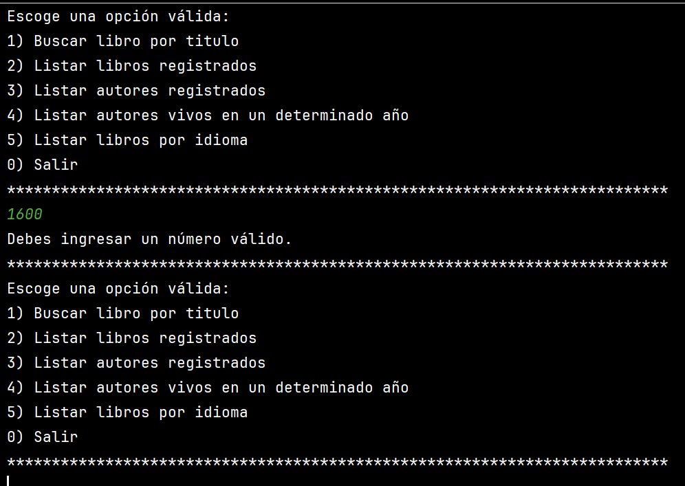
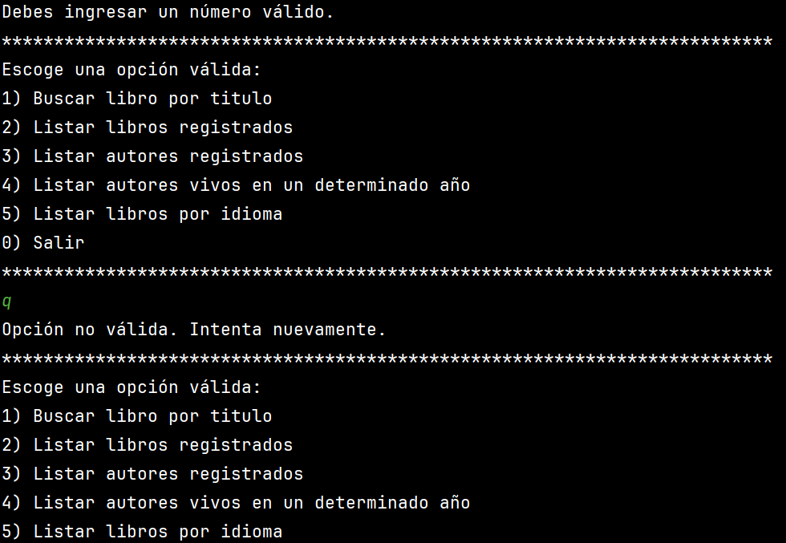
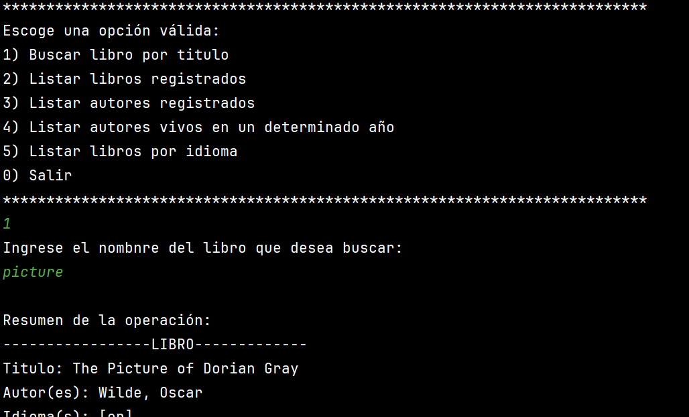
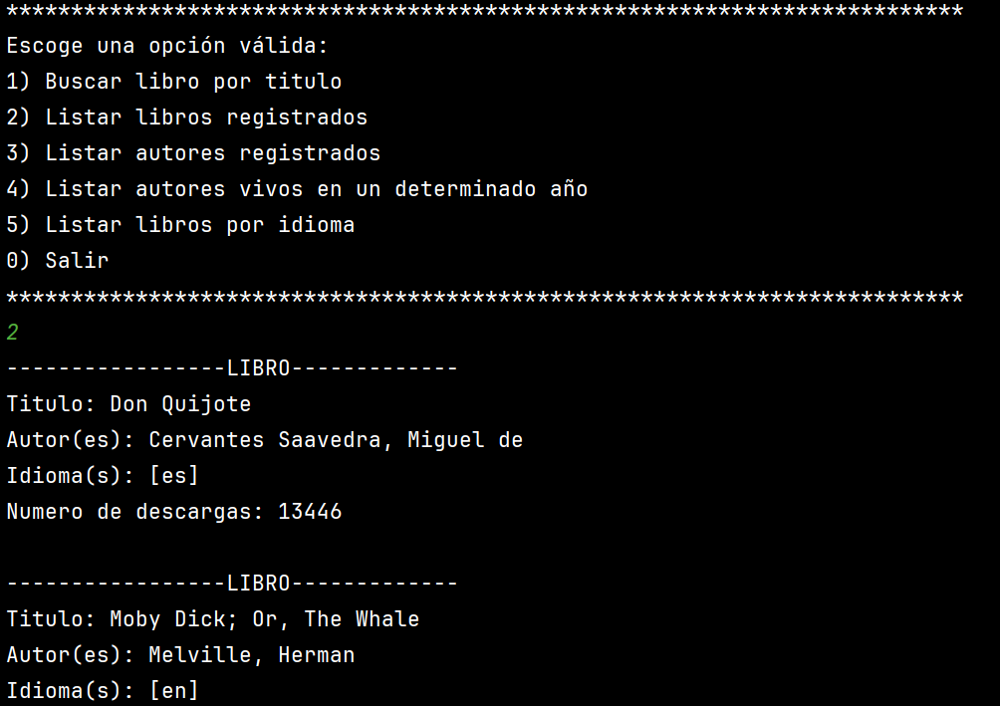
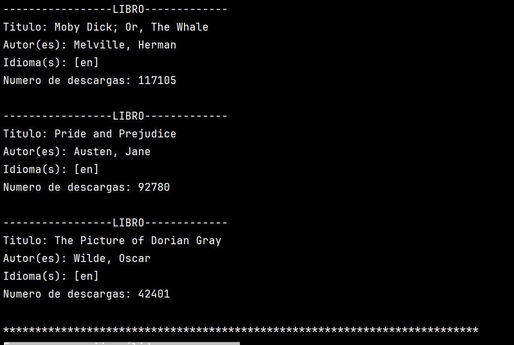
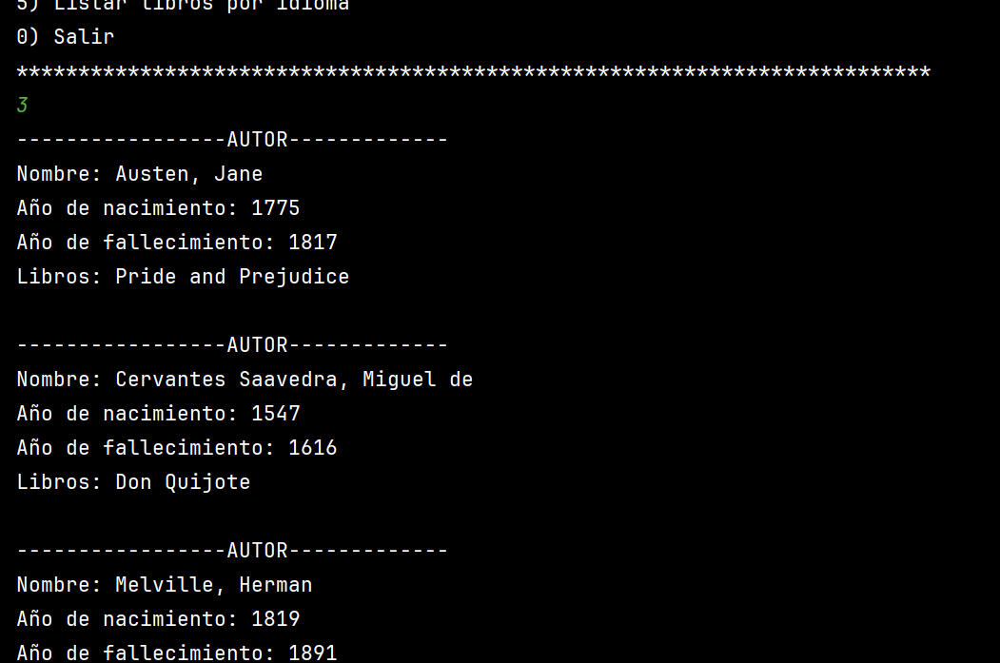
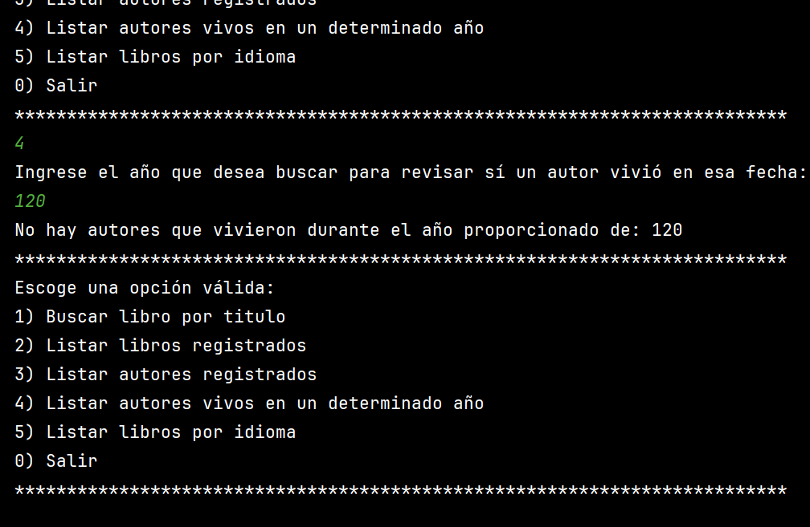
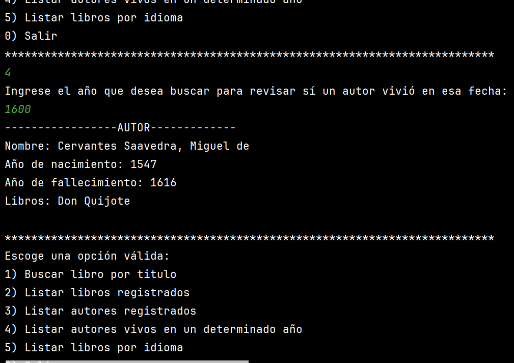
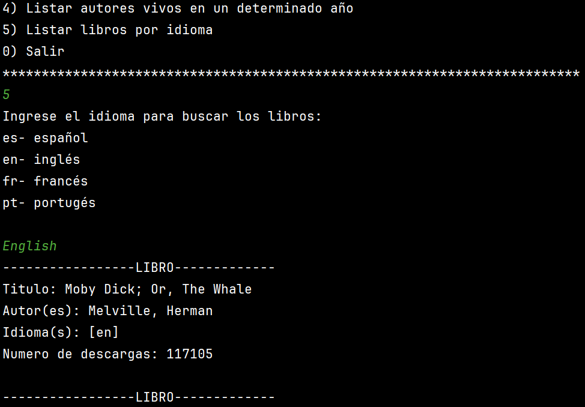
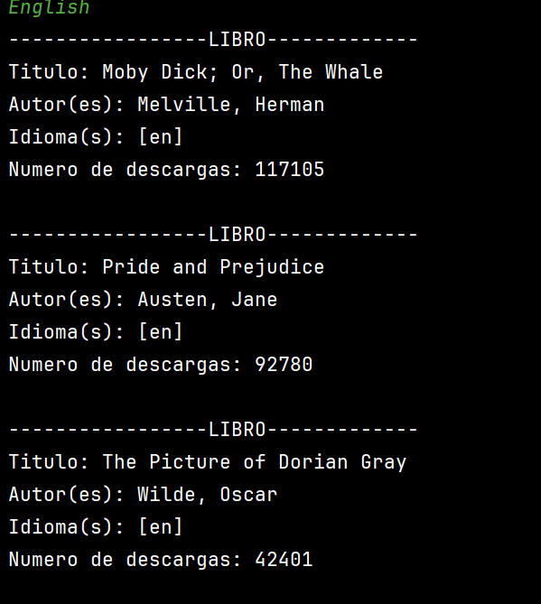
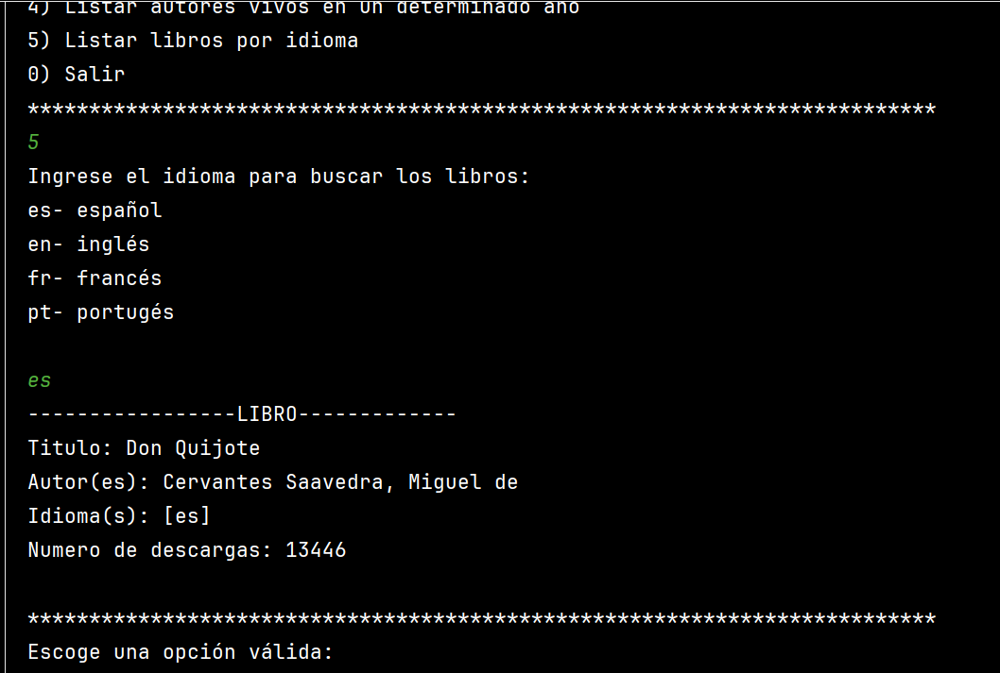
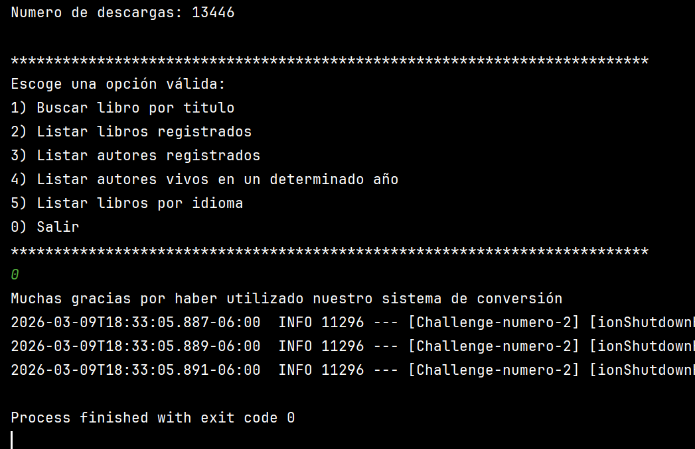
## Autor

Proyecto desarrollado por **Jorge Márquez** como práctica de backend con Java, Spring Boot, JPA y PostgreSQL.
